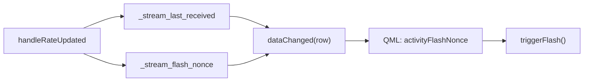

# Activity-driven LED flash for stream list

## Why not `rootObject().findChild(..., "led")`

[`streamInfoListView.qml`](c:\Users\pho\repos\EmotivEpoc\ACTIVE_DEV\stream_viewer\stream_viewer\qml\streamInfoListView.qml) uses a `ListView` with one delegate per stream. `findChild` returns a **single** `QObject`; multiple delegates each contain an LED. Setting one `objectName` on all delegates would still collapse to ambiguous lookup. The reliable pattern is to **drive the flash from the model** at the same time you update [`_stream_last_received`](c:\Users\pho\repos\EmotivEpoc\ACTIVE_DEV\stream_viewer\stream_viewer\data\stream_info.py) in `handleRateUpdated()` — no Python→QML object hunt required.

## Data flow (existing vs new)

## 1. Model changes — [`stream_viewer/data/stream_info.py`](c:\Users\pho\repos\EmotivEpoc\ACTIVE_DEV\stream_viewer\stream_viewer\data\stream_info.py)

- Add `ActivityFlashNonceRole = QtCore.Qt.UserRole + 13` (next free role after `StreamLastReceivedRole`).
- Add `_stream_flash_nonce: dict[stream_key, int]` in `__init__` (mirror structure of `_stream_last_received`).
- In `handleRateUpdated`, on the successful path where `_stream_last_received[stream_key]` is updated, increment `self._stream_flash_nonce[stream_key]` (e.g. `self._stream_flash_nonce[stream_key] = self._stream_flash_nonce.get(stream_key, 0) + 1` so streams with no packets yet stay at implicit 0 and the first packet yields 1 — avoids an initial “flash on bind” if QML guards with `if (activityFlashNonce > 0)`).
- When removing a stream in `refresh()` (same block that `del`s from `_stream_last_received`), also remove `stream_key` from `_stream_flash_nonce`.
- Extend `roleNames()` with `b'activityFlashNonce'`.
- In `data()`, for `ActivityFlashNonceRole`, return `self._stream_flash_nonce.get(stream_key, 0)`.

`dataChanged.emit(cell_index, cell_index)` without a role list already invalidates all roles for that row, so the nonce will propagate; optionally narrow to `[EffRateRole, StreamLastReceivedRole, ActivityStateRole, ActivityFlashNonceRole]` later for micro-optimization (not required).

## 2. QML delegate — [`stream_viewer/qml/streamInfoListView.qml`](c:\Users\pho\repos\EmotivEpoc\ACTIVE_DEV\stream_viewer\stream_viewer\qml\streamInfoListView.qml)

- Replace the current `activityLight` `Rectangle` (lines ~39–51) with your flash pattern:
  - `id` e.g. `activityLed`
  - `property bool flashOn`, `function triggerFlash()`, inner `Timer` ~120 ms, `onTriggered` clears `flashOn`
  - **Idle color**: keep today’s semantics via a `property color idleColor` bound to `activityState` (active / warning / critical / none), matching existing hex colors
  - **Displayed color**: `flashOn ? "lime" : idleColor` (or `#00ff00` vs `lime` — keep user’s `'lime'` / `'#003300'` feel for the pulse; dim idle for “active” can stay `#00ff00` or align with your snippet for active-only — recommend lime flash + existing state colors when not flashing)
- Bind `property int activityFlashNonce: model.activityFlashNonce` and `onActivityFlashNonceChanged: { if (activityFlashNonce > 0) activityLed.triggerFlash() }` so first bind at 0 does not flash.
- Update the tooltip `MouseArea` that references `activityLight` to target `activityLed` (position/size).

## 3. Python widget — [`stream_viewer/widgets/stream_info.py`](c:\Users\pho\repos\EmotivEpoc\ACTIVE_DEV\stream_viewer\stream_viewer\widgets\stream_info.py)

- **No changes required** for the flash: `StreamStatusQMLWidget` already polls `ActivityStateRole` for stale coloring/alerts; the flash is purely event-driven from `handleRateUpdated` via the new role.

## 4. Optional hardening

- If you ever enable ListView item reuse (`reuseItems: true`), nonce changes during reuse could spuriously flash. For LSL stream counts, leaving default reuse off (Qt 5.15 default) is fine; if needed, set `reuseItems: false` on `streamlist` explicitly.

## Files touched

| File | Change |
|------|--------|
| [`stream_viewer/data/stream_info.py`](c:\Users\pho\repos\EmotivEpoc\ACTIVE_DEV\stream_viewer\stream_viewer\data\stream_info.py) | Nonce dict, role, `handleRateUpdated`, cleanup on row remove |
| [`stream_viewer/qml/streamInfoListView.qml`](c:\Users\pho\repos\EmotivEpoc\ACTIVE_DEV\stream_viewer\stream_viewer\qml\streamInfoListView.qml) | LED + timer + `onActivityFlashNonceChanged`; fix tooltip target |

## Testing

- Run the stream status app, connect at least one LSL stream, confirm each rate update produces a brief lime flash while steady color still reflects active/warning/critical from the timer-driven `ActivityStateRole`.
- Hover LED: tooltip still shows `streamLastReceived`.
