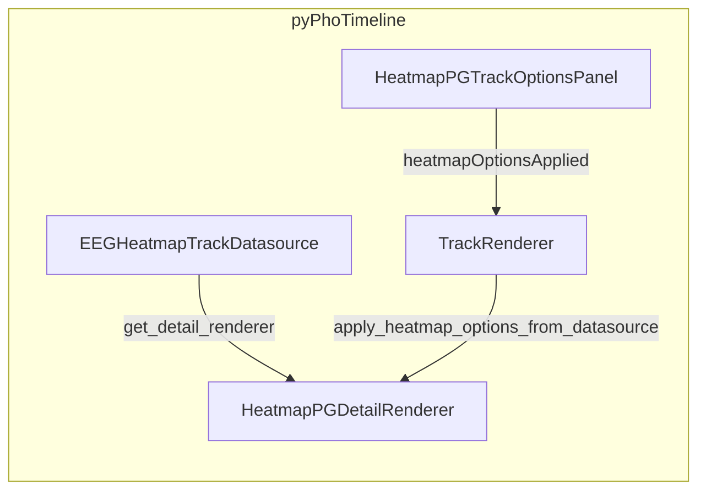

# Historical EEG heatmap track (HeatmapPG-style STFT in pyPhoTimeline)

## Context (what “like line_power” actually did)

- [`line_power_vis.py`](c:/Users/pho/repos/EmotivEpoc/ACTIVE_DEV/stream_viewer/stream_viewer/renderers/line_power_vis.py) and [`line_power_ctrl.py`](c:/Users/pho/repos/EmotivEpoc/ACTIVE_DEV/stream_viewer/stream_viewer/widgets/line_power_ctrl.py) were **not** copied into pyPhoTimeline.
- pyPhoTimeline gained a **timeline detail pipeline**: [`line_power_gfp_detail_renderer.py`](c:/Users/pho/repos/EmotivEpoc/ACTIVE_DEV/pyPhoTimeline/pypho_timeline/rendering/detail_renderers/line_power_gfp_detail_renderer.py), [`EEGFPTrackDatasource`](c:/Users/pho/repos/EmotivEpoc/ACTIVE_DEV/pyPhoTimeline/pypho_timeline/rendering/datasources/specific/eeg.py) in `eeg.py`, [`LinePowerGFPTrackOptionsPanel`](c:/Users/pho/repos/EmotivEpoc/ACTIVE_DEV/pyPhoTimeline/pypho_timeline/widgets/track_options_panels.py), [`TrackRenderer.apply_line_power_gfp_options_from_datasource`](c:/Users/pho/repos/EmotivEpoc/ACTIVE_DEV/pyPhoTimeline/pypho_timeline/rendering/graphics/track_renderer.py), and an `isinstance` branch in [`pyqtgraph_time_synchronized_widget.py`](c:/Users/pho/repos/EmotivEpoc/ACTIVE_DEV/pyPhoTimeline/pypho_timeline/core/pyqtgraph_time_synchronized_widget.py).

[`heatmap_pg.py`](c:/Users/pho/repos/EmotivEpoc/ACTIVE_DEV/stream_viewer/stream_viewer/renderers/heatmap_pg.py) (~1.6k lines) subclasses `RendererDataTimeSeries` and `PGRenderer` from stream_viewer and implements **live** ring-buffer sweep/scroll behavior. **Copying the file verbatim would pull that dependency graph**; the requested historical scope matches the GFP pattern instead: **port the STFT/dB core** (~80 lines around `_compute_spectrogram` and channel averaging) into a **detail renderer** that consumes a per-interval EEG DataFrame.

## Relationship to existing EEG spectrogram track

- [`EEGSpectrogramTrackDatasource`](c:/Users/pho/repos/EmotivEpoc/ACTIVE_DEV/pyPhoTimeline/pypho_timeline/rendering/datasources/specific/eeg.py) + [`EEGSpectrogramDetailRenderer`](c:/Users/pho/repos/EmotivEpoc/ACTIVE_DEV/pyPhoTimeline/pypho_timeline/rendering/datasources/specific/eeg.py) display **precomputed** spectrograms from raws (`compute_multiraw_spectrogram_results`), with an options panel for freq bounds and channel groups.
- The new track computes a spectrogram **on the fly from `detailed_df`** using **scipy `signal.spectrogram`** (same spirit as HeatmapPG: Hann window, density PSD, dB), with parameters aligned to [`HeatmapControlPanel`](c:/Users/pho/repos/EmotivEpoc/ACTIVE_DEV/stream_viewer/stream_viewer/widgets/heatmap_ctrl.py) (fmin/fmax, nperseg, noverlap; optional colormap / max segment length). This is complementary: works when you already have timeline EEG samples but do not need (or want) the MNE precompute path.

## Architecture

## Implementation steps

1. **New detail renderer module**  
   Add [`pypho_timeline/rendering/detail_renderers/heatmap_pg_detail_renderer.py`](c:/Users/pho/repos/EmotivEpoc/ACTIVE_DEV/pyPhoTimeline/pypho_timeline/rendering/detail_renderers/heatmap_pg_detail_renderer.py) (name can be `HeatmapPGDetailRenderer` or `EEGHeatmapSTFTDetailRenderer`—pick one and use consistently):
   - Reuse the same **interval clipping** and **optional nominal rate resampling** pattern as [`LinePowerGFPDetailRenderer.render_detail`](c:/Users/pho/repos/EmotivEpoc/ACTIVE_DEV/pyPhoTimeline/pypho_timeline/rendering/detail_renderers/line_power_gfp_detail_renderer.py) (either import `_resample_channels_uniform_grid` from that module or duplicate the small helper to avoid circular imports—prefer the option that keeps imports acyclic).
   - Build a multi-channel matrix via `phopymnehelper.analysis.computations.gfp_band_power.dataframe_to_channel_matrix` (already a pyPhoTimeline dependency through GFP).
   - **Channel combine**: `nanmean` across channels (same idea as HeatmapPG `_average_channels`), then `spectrogram` with Hann window, matching HeatmapPG’s `scaling='density'`, `mode='psd'`, and dB scaling (`10 * log10(Sxx + eps)`), with `MIN_NPERSEG`-style guards from heatmap_pg.
   - **Display**: Follow [`EEGSpectrogramDetailRenderer.render_detail`](c:/Users/pho/repos/EmotivEpoc/ACTIVE_DEV/pyPhoTimeline/pypho_timeline/rendering/datasources/specific/eeg.py) for `ImageItem` + `setRect` (time span from interval, vertical 0–1) and `get_detail_bounds` frequency range from `fmin_hz`/`fmax_hz` crop—keeps behavior consistent with existing spectrogram tracks and timeline Y-range handling.
   - **Constructor knobs** (backed by datasource): `fmin_hz`, `fmax_hz`, `nperseg`, `noverlap`, `color_set` (string for `pg.colormap.get`, default `viridis`), `max_samples_per_spectrogram` (optional cap with simple decimation like HeatmapPG), `channel_names` / `nominal_srate` (same semantics as GFP for “timeline df is downsampled”).

2. **New datasource in `eeg.py`**  
   Add `EEGHeatmapTrackDatasource(EEGTrackDatasource)` alongside `EEGFPTrackDatasource`:
   - Same construction pattern as GFP: `intervals_df`, `eeg_df`/`detailed_df`, `channel_names`, downsampling flags, `raw_datasets_dict` for optional default `nominal_srate` (reuse `_first_sfreq_from_raw_datasets_dict` from the same file).
   - Private fields `_heatmap_fmin_hz`, `_heatmap_fmax_hz`, `_heatmap_nperseg`, `_heatmap_noverlap`, `_heatmap_color_set`, `_heatmap_max_samples`, `_heatmap_nominal_srate`.
   - `set_heatmap_display_params(...)` mutating those fields (mirror `set_gfp_display_params`).
   - `get_detail_renderer()` returns the new renderer with current params + `channel_names`.

3. **Options panel** in [`track_options_panels.py`](c:/Users/pho/repos/EmotivEpoc/ACTIVE_DEV/pyPhoTimeline/pypho_timeline/widgets/track_options_panels.py):
   - New constant e.g. `TRACK_OPTIONS_KIND_EEG_HEATMAP_STFT` (distinct from `TRACK_OPTIONS_KIND_EEG_SPECTROGRAM`).
   - `HeatmapPGTrackOptionsPanel` (or `EEGHeatmapSTFTTrackOptionsPanel`): spin boxes for fmin/fmax, nperseg, noverlap; optional combo/spin for colormap and max samples; nominal rate auto/manual like GFP if you expose it (recommended for parity with GFP docs).
   - Signal `heatmapOptionsApplied` (or `stftOptionsApplied`); `dump_track_options_state` / `apply_track_options_state` for serialization parity with GFP/spectrogram panels.

4. **TrackRenderer**  
   In [`track_renderer.py`](c:/Users/pho/repos/EmotivEpoc/ACTIVE_DEV/pyPhoTimeline/pypho_timeline/rendering/graphics/track_renderer.py), add `apply_eeg_heatmap_options_from_datasource` (same body pattern as `apply_line_power_gfp_options_from_datasource`: refresh `detail_renderer` from datasource, `_trigger_visibility_render()`).

5. **Dock options wiring**  
   In [`pyqtgraph_time_synchronized_widget.py`](c:/Users/pho/repos/EmotivEpoc/ACTIVE_DEV/pyPhoTimeline/pypho_timeline/core/pyqtgraph_time_synchronized_widget.py), extend the options-panel factory chain (after spectrogram / GFP checks): if `isinstance(track_renderer.datasource, EEGHeatmapTrackDatasource)`, instantiate the new panel, connect `heatmapOptionsApplied` → `track_renderer.apply_eeg_heatmap_options_from_datasource`, set `is_eeg_heatmap_panel = True`, and exclude that track from the generic channel-visibility panel branch (same pattern as `is_eeg_spectrogram_panel` / `is_eeg_fp_gfp_panel`).

6. **Exports and discoverability**  
   - Register lazy export in [`detail_renderers/__init__.py`](c:/Users/pho/repos/EmotivEpoc/ACTIVE_DEV/pyPhoTimeline/pypho_timeline/rendering/detail_renderers/__init__.py) `_LAZY_DETAIL_RENDERER_MODULES` + `__all__`.
   - Export `EEGHeatmapTrackDatasource` from [`datasources/specific/__init__.py`](c:/Users/pho/repos/EmotivEpoc/ACTIVE_DEV/pyPhoTimeline/pypho_timeline/rendering/datasources/specific/__init__.py) and `eeg.py` `__all__`.
   - Add `__init__.py` exports for the new panel in [`widgets/track_options_panels.py`](c:/Users/pho/repos/EmotivEpoc/ACTIVE_DEV/pyPhoTimeline/pypho_timeline/widgets/track_options_panels.py) bottom `__all__` list.

7. **Tests**  
   Add a small test next to [`tests/test_eegfp_track_datasource.py`](c:/Users/pho/repos/EmotivEpoc/ACTIVE_DEV/pyPhoTimeline/tests/test_eegfp_track_datasource.py): stub the detail renderer module if needed (same style as GFP test), assert `get_detail_renderer()` returns the new class and that `set_heatmap_display_params` updates internal state.

8. **Documentation in code**  
   Class docstring on `EEGHeatmapTrackDatasource` with a **usage snippet** mirroring the GFP example in `EEGFPTrackDatasource` (clone `intervals_df`/`detailed_df`, `add_new_embedded_pyqtgraph_render_plot_widget`, `add_track`, `getOptionsPanel`). Note explicitly that **high-frequency content requires adequate `nominal_srate` or dense `detailed_df`**, same caveat as GFP.

## Explicit non-goals (this pass)

- No **live LSL** rolling spectrogram (that would be a separate datasource + update loop, closer to full HeatmapPG).
- No dependency on `stream_viewer` from pyPhoTimeline.
- No notebook edits unless you later ask to update examples.

## Dependency check

- `scipy` is already required for HeatmapPG-style STFT in stream_viewer; confirm pyPhoTimeline’s environment lists `scipy` (if missing, add via `uv add scipy` in the pyPhoTimeline project root when implementing).
