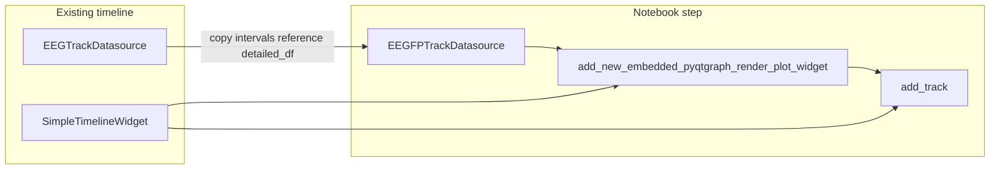

# EEGFP historical track datasource

## Goal

Introduce a dedicated **`EEGFPTrackDatasource`** (name aligns with [`LiveEEGFPTrackDatasource`](c:/Users/pho/repos/EmotivEpoc/ACTIVE_DEV/pyPhoTimeline/pypho_timeline/rendering/datasources/specific/lsl.py)) for **retrospective** EEG: same data contract as [`EEGTrackDatasource`](c:/Users/pho/repos/EmotivEpoc/ACTIVE_DEV/pyPhoTimeline/pypho_timeline/rendering/datasources/specific/eeg.py) (`intervals_df`, `eeg_df` as `detailed_df` with `t` + channel columns), but detail rendering uses [`LinePowerGFPDetailRenderer`](c:/Users/pho/repos/EmotivEpoc/ACTIVE_DEV/pyPhoTimeline/pypho_timeline/rendering/detail_renderers/line_power_gfp_detail_renderer.py) with **`live_mode=False`** so bootstrap CI can be used when desired.

## Implementation

**File:** [`pypho_timeline/rendering/datasources/specific/eeg.py`](c:/Users/pho/repos/EmotivEpoc/ACTIVE_DEV/pyPhoTimeline/pypho_timeline/rendering/datasources/specific/eeg.py)

1. **Import** `LinePowerGFPDetailRenderer` (local import inside `get_detail_renderer` is acceptable if you want to minimize top-level churn; top-level is fine given `eeg.py` already imports detail renderers).

2. **Class `EEGFPTrackDatasource(EEGTrackDatasource)`**
   - **`__init__`**: Call `super().__init__(...)` with the same signature as `EEGTrackDatasource` (forward all kwargs). Optionally accept GFP-specific kwargs with safe defaults: `gfp_filter_order=4`, `gfp_n_bootstrap=100`, `gfp_baseline_start=None`, `gfp_baseline_end=0.0`, `gfp_show_confidence=False`, `gfp_line_width=0.5` — store on `self` for `get_detail_renderer`.
   - **`get_detail_renderer`**: Return `LinePowerGFPDetailRenderer(channel_names=..., live_mode=False, filter_order=..., n_bootstrap=..., baseline_start=..., baseline_end=..., show_confidence=..., line_width=...)`. Pass **`channel_names=self.channel_names`** when set (mirror EEG path in the parent at ```493:498:c:/Users/pho/repos/EmotivEpoc/ACTIVE_DEV/pyPhoTimeline/pypho_timeline/rendering/datasources/specific/eeg.py```).

3. **Do not duplicate** interval fetch, downsampling, masking, or `exclude_bad_channels` — inherited from `EEGTrackDatasource` / `IntervalProvidingTrackDatasource`.

4. **Exports:** Append `'EEGFPTrackDatasource'` to [`__all__`](c:/Users/pho/repos/EmotivEpoc/ACTIVE_DEV/pyPhoTimeline/pypho_timeline/rendering/datasources/specific/eeg.py) (around line 1295).

5. **Optional:** If [`pypho_timeline/rendering/datasources/specific/__init__.py`](c:/Users/pho/repos/EmotivEpoc/ACTIVE_DEV/pyPhoTimeline/pypho_timeline/rendering/datasources/specific/__init__.py) re-exports EEG types, add `EEGFPTrackDatasource` there for symmetry (only if the file already lists `EEGTrackDatasource`).

## Documentation: class docstring “Usage:” (notebook, post-build timeline)

Include a **copy-paste-oriented** block in the class docstring (no edits to [`testing_notebook.ipynb`](c:/Users/pho/repos/EmotivEpoc/ACTIVE_DEV/pyPhoTimeline/testing_notebook.ipynb) unless the user later asks). Pattern matches [`live_lsl_timeline.py`](c:/Users/pho/repos/EmotivEpoc/ACTIVE_DEV/pyPhoTimeline/live_lsl_timeline.py) (dock + `add_track`) and [`TimelineBuilder._add_tracks_to_timeline`](c:/Users/pho/repos/EmotivEpoc/ACTIVE_DEV/pyPhoTimeline/pypho_timeline/timeline_builder.py) (embed widget then `timeline.add_track`).

Suggested docstring flow:

- Assume `timeline: SimpleTimelineWidget` already built, and `eeg_ds: EEGTrackDatasource` is an existing datasource (same session).
- Build `gfp_ds = EEGFPTrackDatasource(intervals_df=eeg_ds.intervals_df.copy(), eeg_df=eeg_ds.detailed_df, custom_datasource_name=f"{eeg_ds.custom_datasource_name}_GFP", channel_names=eeg_ds.channel_names, max_points_per_second=eeg_ds.max_points_per_second, enable_downsampling=eeg_ds.enable_downsampling, lab_obj_dict=getattr(eeg_ds, "lab_obj_dict", None), raw_datasets_dict=getattr(eeg_ds, "raw_datasets_dict", None))` — adjust if some attributes are not public; **sharing `eeg_df` by reference** is OK for read-only visualization.
- Create dock + plot: `timeline.add_new_embedded_pyqtgraph_render_plot_widget(name=gfp_ds.custom_datasource_name, dockSize=(500, 120), dockAddLocationOpts=["bottom"], sync_mode=SynchronizedPlotMode.TO_GLOBAL_DATA)` (import `SynchronizedPlotMode` from [`pypho_timeline.core.synchronized_plot_mode`](c:/Users/pho/repos/EmotivEpoc/ACTIVE_DEV/pyPhoTimeline/pypho_timeline/core/synchronized_plot_mode.py)).
- **Sync X to an existing track:** e.g. pick a reference `PlotItem` from `timeline.ui.matplotlib_view_widgets[some_track_name].getRootPlotItem()` and set `gfp_plot.setXRange(*ref_plot.getViewBox().viewRange()[0], padding=0)` (avoids duplicating datetime-vs-unix logic from the builder).
- **`gfp_plot.setYRange(0, 5, padding=0)`** and `hideAxis("left")` optional, consistent with GFP lane layout.
- **`timeline.add_track(gfp_ds, name=gfp_ds.custom_datasource_name, plot_item=gfp_plot)`** — matches [`TrackRenderingMixin.add_track`](c:/Users/pho/repos/EmotivEpoc/ACTIVE_DEV/pyPhoTimeline/pypho_timeline/rendering/mixins/track_rendering_mixin.py).



## Tests (lightweight)

Add or extend a small test in [`pypho_timeline/tests/`](c:/Users/pho/repos/EmotivEpoc/ACTIVE_DEV/pyPhoTimeline/tests) (e.g. next to [`test_multi_raw_eeg_datasource.py`](c:/Users/pho/repos/EmotivEpoc/ACTIVE_DEV/pyPhoTimeline/tests/test_multi_raw_eeg_datasource.py)): construct minimal `intervals_df` + `eeg_df`, `EEGFPTrackDatasource(...)`, assert `isinstance(ds.get_detail_renderer(), LinePowerGFPDetailRenderer)` and `get_detail_renderer()._live_mode is False` (or equivalent public behavior if underscore should stay private — prefer checking behavior via type + `live_mode` constructor path).

## Out of scope

- Auto-injecting this track inside `TimelineBuilder._extract_datasources_from_eeg_raw` (can be a follow-up flag).
- Editing the plan file in `.cursor/plans/`.
