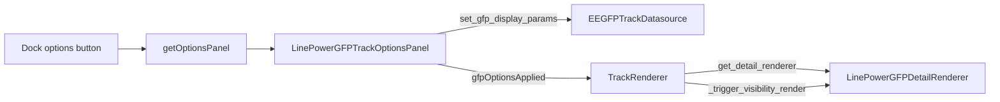

# GFP track dock options panel (native)

## Context

- The dock **options** button is driven by [`Dock._getOptionsPanel`](c:\Users\pho\repos\EmotivEpoc\ACTIVE_DEV\pyPhoTimeline\pypho_timeline\EXTERNAL\pyqtgraph\dockarea\Dock.py): it uses `widget.getOptionsPanel()` or `widget.optionsPanel`.
- [`PyqtgraphTimeSynchronizedWidget.getOptionsPanel`](c:\Users\pho\repos\EmotivEpoc\ACTIVE_DEV\pyPhoTimeline\pypho_timeline\core\pyqtgraph_time_synchronized_widget.py) already special-cases `EEGSpectrogramTrackDatasource`, then treats **any** `detail_renderer` with `channel_names` as a **channel visibility** panel.
- [`LinePowerGFPDetailRenderer`](c:\Users\pho\repos\EmotivEpoc\ACTIVE_DEV\pyPhoTimeline\pypho_timeline\rendering\detail_renderers\line_power_gfp_detail_renderer.py) has `channel_names` but **does not** use `channel_visibility` in `render_detail`, so the current panel is the wrong UX for GFP; GFP tuning lives on [`EEGFPTrackDatasource`](c:\Users\pho\repos\EmotivEpoc\ACTIVE_DEV\pyPhoTimeline\pypho_timeline\rendering\datasources\specific\eeg.py) as `_gfp_*` fields consumed by `get_detail_renderer()`.
- [`stream_viewer`’s `COMPAT_ICONTROL` / `LinePowerControlPanel`](c:\Users\pho\repos\EmotivEpoc\ACTIVE_DEV\stream_viewer\stream_viewer\renderers\line_power_vis.py) is a different stack (renderer + `TimeSeriesControl`); **you chose** a **native** timeline panel instead of adding a `stream_viewer` dependency.

## Implementation

### 1. Datasource API on `EEGFPTrackDatasource`

In [`eeg.py`](c:\Users\pho\repos\EmotivEpoc\ACTIVE_DEV\pyPhoTimeline\pypho_timeline\rendering\datasources\specific\eeg.py), add a small **public** mutator (single-line signature per your style), e.g. `set_gfp_display_params(...)`, that updates `_gfp_filter_order`, `_gfp_n_bootstrap`, `_gfp_baseline_start`, `_gfp_baseline_end`, `_gfp_show_confidence`, `_gfp_line_width`, and optionally `_gfp_nominal_srate` with the same validation/normalization as `__init__` (e.g. `n_bootstrap >= 10`, nominal srate `None` when invalid). This keeps the panel thin and avoids reaching into private fields from the UI.

### 2. `LinePowerGFPTrackOptionsPanel`

In [`track_options_panels.py`](c:\Users\pho\repos\EmotivEpoc\ACTIVE_DEV\pyPhoTimeline\pypho_timeline\widgets\track_options_panels.py), add a panel modeled on [`EEGSpectrogramTrackOptionsPanel`](c:\Users\pho\repos\EmotivEpoc\ACTIVE_DEV\pyPhoTimeline\pypho_timeline\widgets\track_options_panels.py) (grid/spinboxes, `optionsChanged`, dedicated `gfpOptionsApplied` signal):

- **Controls**: filter order, n bootstrap, baseline end, optional baseline start (UI for `None` = “from segment/data start”, e.g. checkbox + enabled spin), show confidence, line width, nominal sample rate (spinbox or “auto” checkbox matching current `None` behavior).
- **On change**: call `set_gfp_display_params` on `track_renderer.datasource`, emit `gfpOptionsApplied` and `optionsChanged` (same pattern as `_apply_all_to_datasource` + `spectrogramOptionsApplied` for spectrogram).
- **Serialization (optional but consistent)**: add a `TRACK_OPTIONS_KIND_*` constant and implement `track_options_kind` / `dump_track_options_state` / `apply_track_options_state` like the spectrogram and channel panels, so saved layouts can restore GFP settings.

Export the new class from the module’s `__all__` list in that file.

### 3. `TrackRenderer` refresh hook

In [`track_renderer.py`](c:\Users\pho\repos\EmotivEpoc\ACTIVE_DEV\pyPhoTimeline\pypho_timeline\rendering\graphics\track_renderer.py), add `apply_line_power_gfp_options_from_datasource` mirroring [`apply_eeg_spectrogram_options_from_datasource`](c:\Users\pho\repos\EmotivEpoc\ACTIVE_DEV\pyPhoTimeline\pypho_timeline\rendering\graphics\track_renderer.py):

```python
def apply_line_power_gfp_options_from_datasource(self) -> None:
    self.detail_renderer = self.datasource.get_detail_renderer()
    self._trigger_visibility_render()
```

### 4. Branch in `getOptionsPanel`

In [`pyqtgraph_time_synchronized_widget.py`](c:\Users\pho\repos\EmotivEpoc\ACTIVE_DEV\pyPhoTimeline\pypho_timeline\core\pyqtgraph_time_synchronized_widget.py), after the spectrogram `if` block:

- Introduce `is_eeg_fp_gfp_panel = False`.
- If `track_renderer` is not `None` and `isinstance(track_renderer.datasource, EEGFPTrackDatasource)`, instantiate `LinePowerGFPTrackOptionsPanel`, set `desired_connections` like the spectrogram block (panel ↔ mixin ↔ `track_renderer.on_options_*`), connect `gfpOptionsApplied` → `track_renderer.apply_line_power_gfp_options_from_datasource`, call `set_options_panel` if present, set `is_eeg_fp_gfp_panel = True`.

Change the channel-visibility condition from `if not is_eeg_spectrogram_panel and ...` to **also** require `not is_eeg_fp_gfp_panel`, so GFP tracks no longer get the misleading channel-only panel.

### 5. Notebook / manual `add_track` flow

[`add_track`](c:\Users\pho\repos\EmotivEpoc\ACTIVE_DEV\pyPhoTimeline\pypho_timeline\rendering\mixins\track_rendering_mixin.py) already calls `set_track_renderer` on the named `PyqtgraphTimeSynchronizedWidget`, so `getOptionsPanel()` can see the full `TrackRenderer`.

After your GFP snippet’s `timeline.add_track(...)`, you still need to **materialize** the panel reference and refresh the dock chrome (same as the video example in [`testing_notebook.ipynb`](c:\Users\pho\repos\EmotivEpoc\ACTIVE_DEV\pyPhoTimeline\testing_notebook.ipynb)):

- `track_widget.optionsPanel = track_widget.getOptionsPanel()`
- `_dock.updateWidgetsHaveOptionsPanel()` (and optional `_dock.update()` / `updateTitleBar` like existing examples)

Per your rule, **edits to `testing_notebook.ipynb` require your explicit approval**; the plan is to either add those lines once you approve, or you paste them yourself.

### 6. Docstring touch-up

Extend the `EEGFPTrackDatasource` usage docstring in [`eeg.py`](c:\Users\pho\repos\EmotivEpoc\ACTIVE_DEV\pyPhoTimeline\pypho_timeline\rendering\datasources\specific\eeg.py) with the two lines above so future copies of the snippet get the dock button.

## Data flow (after change)



## Out of scope (optional follow-ups)

- **`LiveEEGFPTrackDatasource`**: its `get_detail_renderer()` is fixed today; extending live GFP with the same `_gfp_*` fields and panel support would be a separate small change.
- **Channel inclusion in GFP**: if you want per-channel toggles to affect GFP math, `LinePowerGFPDetailRenderer.render_detail` would need to respect `channel_visibility` when building `ch_found` / `data_mat`.
