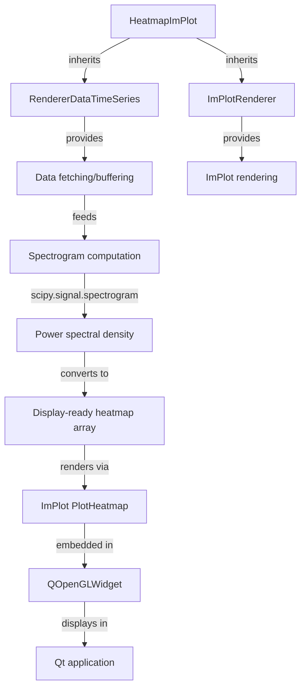

# ImPlot GPU-Accelerated Spectrogram Renderer

## Overview

Create an experimental alternative spectrogram renderer (`HeatmapImPlot`) that uses ImPlot for GPU-accelerated rendering while maintaining compatibility with the existing renderer architecture. The implementation will embed ImPlot within Qt widgets using OpenGL context embedding.

## Architecture

The new renderer will:

- Follow the same dual-inheritance pattern as `HeatmapPG`: `RendererDataTimeSeries` + display base class
- Reuse spectrogram computation from `HeatmapPG` (CPU-based `scipy.signal.spectrogram`)
- Use ImPlot's `PlotHeatmap` for GPU-accelerated rendering
- Embed ImPlot rendering within Qt using `QOpenGLWidget` or similar



## Implementation Steps

### 1. Research and Select Python Binding

**Recommendation: `slimgui`**

- Modern, actively maintained
- Typing support (.pyi files) for IDE completion
- Built against Dear ImGui 1.92.1
- Supports pyOpenGL backend for Qt integration
- Python 3.10+ compatible (project requires 3.8-3.11, may need to verify compatibility)

**Action**: Verify `slimgui` compatibility with Python 3.8-3.11, or consider `imviz` as fallback.

### 2. Create Display Base Class

**File**: `stream_viewer/stream_viewer/renderers/display/implot.py`Create `ImPlotRenderer` base class similar to `PGRenderer`:

- Manages ImPlot context creation/destruction
- Handles OpenGL widget setup
- Provides colormap utilities compatible with ImPlot
- Implements timer-based update loop

Key considerations:

- ImPlot context lifecycle: `ImPlot::CreateContext()` / `ImPlot::DestroyContext()`
- OpenGL context sharing between Qt and ImPlot
- Frame rendering in `on_timer()` method

### 3. Create HeatmapImPlot Renderer

**File**: `stream_viewer/stream_viewer/renderers/heatmap_implot.py`Structure similar to `HeatmapPG`:

- Inherit from `RendererDataTimeSeries` and `ImPlotRenderer`
- Reuse `SourceState` dataclass for per-source state management
- Copy spectrogram computation methods:
- `_compute_channel_average()` from `heatmap_pg.py:409`
- `_compute_spectrogram()` from `heatmap_pg.py:437`
- `_calculate_new_columns()` from `heatmap_pg.py:475`
- `_update_heatmap_columns()` from `heatmap_pg.py:509`
- `_prepare_display_heatmap()` from `heatmap_pg.py:549`
- `_update_color_levels()` from `heatmap_pg.py:579`

Key differences from `HeatmapPG`:

- Replace `RemoteGraphicsView` with `QOpenGLWidget` for ImPlot rendering
- Replace `ImageItem.setImage()` with `ImPlot::PlotHeatmap()`
- Use ImPlot's colormap system instead of PyQtGraph LUTs
- Handle ImPlot's immediate mode rendering (render each frame)

### 4. Implement Qt-ImPlot Integration

**Challenge**: Embedding ImPlot in Qt requires:

- Creating OpenGL context compatible with both Qt and ImPlot
- Using slimgui's backend (likely `slimgui.backends.pyopengl`)
- Wrapping ImPlot rendering in Qt widget lifecycle

**Approach**:

- Use `QOpenGLWidget` as the native widget
- Initialize ImPlot context in widget's `initializeGL()` or similar
- Render ImPlot in `paintGL()` method
- Handle resize events to update ImPlot viewport

**Reference**: Look at slimgui examples for Qt integration patterns.

### 5. Update Dependencies

**File**: `pyproject.toml`Add new dependency:

```toml
dependencies = [
    # ... existing dependencies ...
    "slimgui>=0.1.0",  # or version available
]
```

If `slimgui` requires Python 3.10+, consider:

- Making it an optional dependency
- Or documenting Python version requirement for this renderer

### 6. Register Renderer

**File**: `stream_viewer/stream_viewer/renderers/__init__.py`Add import:

```python
from stream_viewer.renderers.heatmap_implot import HeatmapImPlot
```

This makes it discoverable via `list_renderers()`.

### 7. Optional: Control Panel Compatibility

**File**: `stream_viewer/stream_viewer/widgets/heatmap_ctrl.py`The existing `HeatmapControlPanel` should work with `HeatmapImPlot` if:

- It uses the same `COMPAT_ICONTROL = ['HeatmapControlPanel']` declaration
- Property names match (fmin_hz, fmax_hz, nperseg, noverlap, etc.)

Verify compatibility or create `HeatmapImPlotControlPanel` if needed.

## Technical Considerations

### OpenGL Context Management

- Qt's `QOpenGLWidget` manages its own OpenGL context
- ImPlot/slimgui needs access to this context
- May need to share context or use Qt's context sharing mechanisms

### Performance Optimization

- ImPlot is GPU-accelerated, but data transfer (CPU→GPU) still matters
- Consider using numpy arrays directly with ImPlot (check slimgui API)
- Minimize data copying between computation and rendering

### Colormap Translation

- PyQtGraph colormaps vs ImPlot colormaps
- May need mapping between colormap names
- Or implement custom colormap generation for ImPlot

### Error Handling

- Handle cases where OpenGL/ImPlot initialization fails
- Graceful fallback or clear error messages
- Consider making renderer optional if dependencies unavailable

## Testing Strategy

1. **Unit Tests**: Test spectrogram computation (reused from HeatmapPG)
2. **Integration Tests**: Verify Qt widget embedding works
3. **Performance Tests**: Compare rendering performance vs HeatmapPG
4. **Visual Tests**: Verify visual output matches HeatmapPG (same data, same appearance)

## Files to Create/Modify

**New Files**:

- `stream_viewer/stream_viewer/renderers/display/implot.py` - ImPlotRenderer base class
- `stream_viewer/stream_viewer/renderers/heatmap_implot.py` - Main renderer implementation

**Modified Files**:

- `pyproject.toml` - Add slimgui dependency
- `stream_viewer/stream_viewer/renderers/__init__.py` - Register new renderer

**Reference Files** (read-only for understanding):

- `stream_viewer/stream_viewer/renderers/heatmap_pg.py` - Existing implementation
- `stream_viewer/stream_viewer/renderers/display/pyqtgraph.py` - Display base class pattern

## Success Criteria

- [ ] New `HeatmapImPlot` renderer appears in available renderers list
- [ ] Can be selected and instantiated in the application
- [ ] Displays spectrograms with GPU-accelerated rendering
- [ ] Maintains same visual appearance as HeatmapPG (or acceptable alternative)
- [ ] Performance is equal or better than HeatmapPG for large datasets
- [ ] Handles multiple data sources correctly
- [ ] Supports Sweep and Scroll plot modes
- [ ] Compatible with existing control panel (or has working alternative)

## Risks and Mitigations

**Risk**: slimgui may not support Python 3.8-3.11

- **Mitigation**: Check compatibility first, use `imviz` as fallback, or make optional

**Risk**: OpenGL context sharing issues between Qt and ImPlot

- **Mitigation**: Research slimgui Qt integration examples, test thoroughly