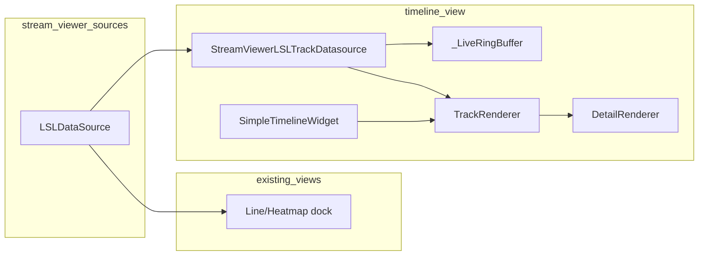

# Render live LSL streams on pyPhoTimeline tracks from stream_viewer

## Current state

**stream_viewer** ([stream_viewer/data/stream_lsl.py](c:\Users\pho\repos\EmotivEpoc\ACTIVE_DEV\stream_viewer\stream_viewer\data\stream_lsl.py)):

- **LSLDataSource**: single LSL inlet (or ContinuousResolver), `fetch_data() -> (data, timestamps)` with `data` shape `(channels, samples)`.
- No timeline widget; each view is a dock with a renderer (line, heatmap, bar, topo, etc.) driven by a display timer that calls `fetch_data()` then `update_visualization()`.

**pyPhoTimeline** ([pypho_timeline/rendering/datasources/specific/lsl.py](c:\Users\pho\repos\EmotivEpoc\ACTIVE_DEV\pyPhoTimeline\pypho_timeline\rendering\datasources\specific\lsl.py)):

- **TrackDatasource** protocol: `df`, `time_column_names`, `total_df_start_end_times`, `get_updated_data_window()`, **fetch_detailed_data(interval)** (thread-safe), **get_detail_renderer()**, `source_data_changed_signal`.
- **DetailRenderer** protocol: `render_detail(plot_item, interval, detail_data)`, `clear_detail()`, `get_detail_bounds()`.
- **LiveEEGTrackDatasource** / **LiveMotionTrackDatasource**: use **LSLStreamReceiver** (QTimer + pull_chunk, emits `data_received(channel_names, timestamps, samples)`), maintain `_LiveRingBuffer`, expose one growing interval; `fetch_detailed_data` returns DataFrame slice with columns `['t'] + channel_names`; `get_detail_renderer()` returns EEGPlotDetailRenderer or MotionPlotDetailRenderer.
- **TrackRenderer** calls `_update_overview()` only in `__init_`_; live overview refresh would require connecting the datasource’s change signal to a “refresh overview” path (not currently wired for tracks).
- Detail updates when viewport changes (e.g. live-follow timer in [live_lsl_timeline.py](c:\Users\pho\repos\EmotivEpoc\ACTIVE_DEV\pyPhoTimeline\live_lsl_timeline.py) advances `setXRange` → viewport change → detail fetch/redraw).

stream_viewer does **not** depend on pyPhoTimeline today ([stream_viewer/pyproject.toml](c:\Users\pho\repos\EmotivEpoc\ACTIVE_DEV\stream_viewer\pyproject.toml) has no pypho_timeline entry).

---

## Recommended approach: adapter TrackDatasource in stream_viewer

Use **one LSL connection** (stream_viewer’s **LSLDataSource**) for both existing docks and the timeline. Implement an adapter that implements the TrackDatasource protocol and feeds from that source.

### 1. Add pyPhoTimeline dependency to stream_viewer

- In [stream_viewer/pyproject.toml](c:\Users\pho\repos\EmotivEpoc\ACTIVE_DEV\stream_viewer\pyproject.toml): add `pypho_timeline` (path/editable to `../pyPhoTimeline` or workspace-appropriate path) under `dependencies` or as an optional extra (e.g. `timeline`) if you want to keep the core app installable without it. Optional: use a try/except and `PYPHOTIMELINE_AVAILABLE` in code so the timeline dock is only offered when the package is present.

### 2. Adapter TrackDatasource (stream_viewer)

- **New module** (e.g. `stream_viewer/timeline/stream_viewer_lsl_track_datasource.py` or under `stream_viewer/data/`).
- **Class**: e.g. `StreamViewerLSLTrackDatasource` implementing the **TrackDatasource** protocol by:
  - Holding a reference to stream_viewer’s **LSLDataSource** (or a thin wrapper that exposes the same `fetch_data()` and channel info).
  - Maintaining a **ring buffer** of the last N seconds (same idea as pyPhoTimeline’s `_LiveRingBuffer`): append `(timestamps, samples)` where `samples` is `(n_samples, n_channels)` and column names come from the LSL stream (or a fallback list). Expose `get_window(t_start, t_end) -> DataFrame` with columns `['t'] + channel_names`.
  - **Data flow**: either (a) a QTimer (e.g. 50–100 ms) that calls `lsl_source.fetch_data()`, converts `data` from `(channels, samples)` to `(samples, channels)`, and appends to the ring buffer, or (b) connect to `LSLDataSource.data_updated` and append in that slot. Emit `source_data_changed_signal` (and optionally a `new_data_available`-style signal) when new data is appended.
  - **Intervals**: one “stub” interval that spans `[earliest_timestamp, latest_timestamp]` in the ring buffer; update this whenever the buffer extent changes (same pattern as LiveEEGTrackDatasource._update_intervals). Use the same stub DataFrame structure as pyPhoTimeline (`t_start`, `t_duration`, `t_end`, `t_start_dt`, `t_end_dt`, etc.) so existing timeline code works.
  - **TrackDatasource API**:
    - `df` → current `intervals_df`.
    - `time_column_names`, `total_df_start_end_times` from intervals / buffer extent.
    - `get_updated_data_window(new_start, new_end)` → filter intervals overlapping the window (for one growing interval this is that row or empty).
    - **fetch_detailed_data(interval)** → call `ring_buffer.get_window(t_start, t_end)` and return the DataFrame; must be safe to call from a worker thread (read-only access to the ring buffer under a mutex, as in pyPhoTimeline’s `_LiveRingBuffer`).
    - **get_detail_renderer()** → return a DetailRenderer. Prefer reusing pyPhoTimeline’s:
      - For stream type EEG (or if channel names match typical EEG): return **EEGPlotDetailRenderer** (from `pypho_timeline.rendering.datasources.specific.eeg`).
      - For motion/IMU: return **MotionPlotDetailRenderer** (from `pypho_timeline.rendering.datasources.specific.motion`).
      - Generic time series: **DataframePlotDetailRenderer** or **GenericPlotDetailRenderer** (from `pypho_timeline.rendering.detail_renderers.generic_plot_renderer`).  
      Only add a **custom DetailRenderer** in stream_viewer if you need the timeline detail to look like stream_viewer’s line/heatmap (e.g. same colors, layout); that would implement the three DetailRenderer methods and draw into `plot_item` using the same styling as [stream_viewer/renderers/](c:\Users\pho\repos\EmotivEpoc\ACTIVE_DEV\stream_viewer\stream_viewer\renderers\).
- **Channel names**: obtain from LSLDataSource (e.g. from stream metadata/sig after connection) or from the first chunk’s shape; pass them into the ring buffer and into the chosen detail renderer.

### 3. Embedding the timeline in stream_viewer

- Add a **timeline view** entry point in the main app (e.g. a menu action or a “Open as timeline” when a stream is selected).
- Create a **SimpleTimelineWidget** (from `pypho_timeline.widgets.simple_timeline_widget`) with a suitable initial time range (e.g. now - buffer_seconds to now + window_seconds), and add it as a **dock** (similar to existing ConfigAndRenderWidget docks).
- For each LSL stream chosen for the timeline:
  - If using the **adapter**: instantiate **StreamViewerLSLTrackDatasource** with the existing **LSLDataSource** (or a dedicated one created for this “timeline view”) and the ring buffer duration; start the timer or connect `data_updated` so the buffer is filled.
  - Call **timeline.add_track(track_datasource, name=stream_name, plot_item=...)** (from [TrackRenderingMixin](c:\Users\pho\repos\EmotivEpoc\ACTIVE_DEV\pyPhoTimeline\pypho_timeline\rendering\mixins\track_rendering_mixin.py)).
- Optionally implement **live follow**: a QTimer that periodically sets the timeline viewport (e.g. `setXRange(live_timestamp - window_seconds, live_timestamp)`) so the visible window tracks the live head; this will trigger viewport-based detail refresh (as in [live_lsl_timeline.py](c:\Users\pho\repos\EmotivEpoc\ACTIVE_DEV\pyPhoTimeline\live_lsl_timeline.py)).
- Optional: connect the adapter’s `source_data_changed_signal` (or `new_data_available`) to a slot that calls the TrackRenderer’s overview refresh, if pyPhoTimeline exposes a public method for that (e.g. `refresh_overview()`); otherwise the single overview bar may only reflect the initial stub until the next time the track is recreated.

### 4. Custom DetailRenderer (only if needed)

- **When**: You want timeline detail to match stream_viewer’s line or heatmap look (e.g. same channel stacking, colors, normalization).
- **Where**: New file in stream_viewer, e.g. `stream_viewer/timeline/detail_renderers.py` (or under `stream_viewer/renderers/`).
- **What**: A class implementing the **DetailRenderer** protocol:
  - **render_detail(plot_item, interval, detail_data)**:
    - `detail_data` is the DataFrame from `fetch_detailed_data` (columns `['t'] + channel_names).
    - Create pyqtgraph items (e.g. PlotDataItem per channel or a single plot with offset channels) and add them to `plot_item`; return the list of items.
  - **clear_detail(plot_item, graphics_objects)**: remove those items from the plot.
  - **get_detail_bounds(interval, detail_data)**: return (x_min, x_max, y_min, y_max) from the interval and data extents.
- Use **GenericPlotDetailRenderer** with a custom `render_fn` if you prefer not to implement the full protocol by hand.
- In the adapter’s `get_detail_renderer()`, return this renderer when you want “stream_viewer style” detail; otherwise keep using EEG/Motion/Dataframe renderers from pyPhoTimeline.

---

## Alternative: use pyPhoTimeline’s LSL stack only for timeline

- Do **not** wrap LSLDataSource. When the user opens “timeline view” for a stream:
  - Create pyPhoTimeline’s **LSLStreamReceiver** (e.g. `stream_type='EEG'` or `stream_name=...` from the stream list selection).
  - Create **LiveEEGTrackDatasource** or **LiveMotionTrackDatasource** with that receiver and add_track to a **SimpleTimelineWidget** in a new dock.
  - Start the receiver (`receiver.start()`).
- **Pros**: Minimal code in stream_viewer; reuse existing live datasources and detail renderers; no adapter. **Cons**: Two LSL connection paths (stream_viewer’s LSLDataSource for line/heatmap docks vs LSLStreamReceiver for timeline); possible duplicate inlets if the user opens both a “line” view and a “timeline” view for the same stream. You can mitigate by using timeline-only inlets when in timeline view (no LSLDataSource for that stream in other docks) or by documenting that behavior.

---

## Summary

| Item                | Action                                                                                                                                                                                                                                                        |
| ------------------- | ------------------------------------------------------------------------------------------------------------------------------------------------------------------------------------------------------------------------------------------------------------- |
| **Dependency**      | Add `pypho_timeline` to stream_viewer (required or optional extra).                                                                                                                                                                                           |
| **Adapter**         | Implement `StreamViewerLSLTrackDatasource` in stream_viewer: ring buffer fed from `LSLDataSource.fetch_data()` or `data_updated`, single growing interval, `fetch_detailed_data` → DataFrame slice, `get_detail_renderer()` → EEG/Motion/Dataframe or custom. |
| **UI**              | New dock with `SimpleTimelineWidget`; on stream selection for timeline, create adapter (or pyPhoTimeline receiver) and `add_track(...)`. Optional live-follow timer.                                                                                          |
| **Custom renderer** | Only if timeline detail must match stream_viewer’s line/heatmap; otherwise use pyPhoTimeline’s existing detail renderers.                                                                                                                                     |
| **Live overview**   | Optional: connect adapter’s change signal to TrackRenderer overview refresh if pyPhoTimeline exposes it.                                                                                                                                                      |

This gives a clear path to render a set of live LSL streams on pyPhoTimeline tracks from stream_viewer, with the option to keep a single LSL source (adapter) or to use pyPhoTimeline’s LSL stack for the timeline only.