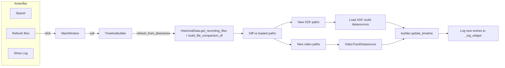

# Refresh XDF and Video from directories (footer button)

## Current state

- **Footer**: [MainTimelineWindow.ui](c:\Users\pho\repos\EmotivEpoc\ACTIVE_DEV\pyPhoTimeline\pypho_timeline\widgets\TimelineWindow\MainTimelineWindow.ui) has `footerBar` with `footerLayout`: spacer + `logToggleButton` ("Show Log"). No reference to builder or discovery config.
- **Discovery**: [main_offline_timeline.py](c:\Users\pho\repos\EmotivEpoc\ACTIVE_DEV\pyPhoTimeline\main_offline_timeline.py) uses `HistoricalData.get_recording_files(recordings_dir=[lab_recorder_output_path, pho_log_to_LSL_recordings_path], recordings_extensions=['.xdf'])`, then `HistoricalData.build_file_comparison_df`, then takes first `n_most_recent_sessions_to_preprocess` to get `final_xdf_paths`. Video directories are not used in this script today.
- **Timeline build**: [TimelineBuilder.build_from_datasources](c:\Users\pho\repos\EmotivEpoc\ACTIVE_DEV\pyPhoTimeline\pypho_timeline\timeline_builder.py) creates `MainTimelineWindow`, adds the timeline to it, and returns the timeline. The builder does not keep references to the window or timeline after return.
- **Adding tracks later**: [TimelineBuilder.update_timeline](c:\Users\pho\repos\EmotivEpoc\ACTIVE_DEV\pyPhoTimeline\pypho_timeline\timeline_builder.py) adds new datasources to an existing timeline and can extend the time range.
- **Log**: [MainTimelineWindow](c:\Users\pho\repos\EmotivEpoc\ACTIVE_DEV\pyPhoTimeline\pypho_timeline\widgets\TimelineWindow\MainTimelineWindow.py) embeds `LogWidget`; `_log_widget.append_log(formatted_message, log_level, log_level_name)` can be used to write refresh messages.

## Architecture

- **Refresh config**: Stored on the builder so refresh can re-run discovery with the same rules (XDF dirs, `n_most_recent`, stream allowlist/blocklist; optional video dirs). The builder must also store the set of paths currently loaded so we can diff and only add new files.
- **Refs for refresh**: When building, the builder creates the window and timeline; it must keep references to both (e.g. `_current_main_window`, `_current_timeline`) so a later `refresh_from_directories()` can call `update_timeline` and log via the window’s log widget.
- **Button**: Footer gets a second button (e.g. "Refresh files") that invokes the builder’s refresh method. The window needs a way to call the builder: pass the builder (or a refresh callback) into `MainTimelineWindow` when the builder creates it.

## Implementation plan

### 1. UI: Add Refresh button

- **File**: [MainTimelineWindow.ui](c:\Users\pho\repos\EmotivEpoc\ACTIVE_DEV\pyPhoTimeline\pypho_timeline\widgets\TimelineWindow\MainTimelineWindow.ui)
- In `footerLayout`, add a `QPushButton` **before** the spacer (so it sits to the left of "Show Log"), e.g. name `refreshFilesButton`, text "Refresh files" (or "Refresh"). Keep the spacer so "Show Log" stays right-aligned.

### 2. TimelineBuilder: Refresh config and state

- **File**: [timeline_builder.py](c:\Users\pho\repos\EmotivEpoc\ACTIVE_DEV\pyPhoTimeline\pypho_timeline\timeline_builder.py)
- Add optional constructor or setter for "refresh config" (or pass it into `build_from_xdf_files`):
  - `xdf_discovery_dirs`: `List[Path]` (e.g. `[lab_recorder_output_path, pho_log_to_LSL_recordings_path]`)
  - `n_most_recent`: `Optional[int]` (same as `n_most_recent_sessions_to_preprocess`)
  - `stream_allowlist` / `stream_blocklist`: same as build
  - Optional: `video_discovery_dirs`: `Optional[List[Path]]` and video extensions / limit for future use
- Store on the builder:
  - `_refresh_config`: the above (None if not set).
  - `_loaded_xdf_paths`: set/list of XDF paths currently on the timeline (set after a successful build and after each refresh).
  - `_loaded_video_paths`: optional set for video paths if video refresh is implemented.
  - `_current_main_window`: reference to the `MainTimelineWindow` created in `build_from_datasources`.
  - `_current_timeline`: reference to the `SimpleTimelineWidget` added to that window.
- In `build_from_datasources`, after creating the window and timeline and adding tracks: set `self._current_main_window = main_window`, `self._current_timeline = timeline`. If a refresh config was provided with this build, set `_loaded_xdf_paths` to the list of XDF paths that were passed to `build_from_xdf_files` (the builder needs to receive and store that list when building from XDF).

### 3. TimelineBuilder: Accept and store refresh config when building from XDF

- **File**: [timeline_builder.py](c:\Users\pho\repos\EmotivEpoc\ACTIVE_DEV\pyPhoTimeline\pypho_timeline\timeline_builder.py)
- Extend `build_from_xdf_files(..., xdf_discovery_dirs=None, n_most_recent=None, ...)` (or a separate `set_refresh_config(...)` called by the entry point before building). If the entry point passes refresh config, builder stores it and stores `_loaded_xdf_paths = list(xdf_file_paths)` after building (so we know what is currently loaded).
- Ensure `build_from_datasources` receives the main_window so it can set `_current_main_window` and pass the builder into the window (see below).

### 4. TimelineBuilder: Implement refresh_from_directories()

- **File**: [timeline_builder.py](c:\Users\pho\repos\EmotivEpoc\ACTIVE_DEV\pyPhoTimeline\pypho_timeline\timeline_builder.py)
- Method `refresh_from_directories()` (or similar name):
  - If `_refresh_config` is None or `_current_timeline` / `_current_main_window` is None, log a warning and return.
  - Run XDF discovery: `HistoricalData.get_recording_files(recordings_dir=xdf_discovery_dirs, recordings_extensions=['.xdf'])`, then `HistoricalData.build_file_comparison_df(recording_files=...)`, then take first `n_most_recent` to get the current "discovered" XDF list.
  - Diff: `new_xdf_paths = [p for p in discovered_xdf_paths if p not in _loaded_xdf_paths]`.
  - For each path in `new_xdf_paths`: log to the window’s text log (e.g. `_current_main_window._log_widget.append_log("Refresh: discovered XDF " + str(p), logging.INFO, "INFO")`).
  - If there are new XDF paths: load them (same as in `build_from_xdf_files`: pyxdf, filter streams, then `perform_process_all_streams_multi_xdf` for **only** the new files to get new datasources). To avoid duplicate track names with existing tracks, give new datasources unique names (e.g. append file stem: `custom_datasource_name = f"EEG_{stream_name} ({path.stem})"` or pass a suffix into the processing path). Then call `self.update_timeline(_current_timeline, new_datasources, update_time_range=True)`.
  - Append to `_loaded_xdf_paths` the paths that were successfully added.
  - Optional (later): If `video_discovery_dirs` is set, discover new video files, create `VideoTrackDatasource` for new ones, log each, then `update_timeline` with the new video datasources and update `_loaded_video_paths`.
- Use the existing logger so messages also go to the log widget if the Qt handler is attached; explicitly calling `_log_widget.append_log` ensures refresh messages appear in the text log.

### 5. MainTimelineWindow: Wire Refresh button and accept builder

- **File**: [MainTimelineWindow.py](c:\Users\pho\repos\EmotivEpoc\ACTIVE_DEV\pyPhoTimeline\pypho_timeline\widgets\TimelineWindow\MainTimelineWindow.py)
- Add an optional constructor parameter, e.g. `refresh_callback: Optional[Callable[[], None]] = None`, or `builder: Optional["TimelineBuilder"] = None`. If `builder` is passed, the refresh button will call `builder.refresh_from_directories()`.
- In `initUI`, create the new button from the .ui (`refreshFilesButton`). Connect its `clicked` to a slot that: if `refresh_callback` is set, call it; else if `builder` is set, call `builder.refresh_from_directories()`. Disable the button if neither is set (or hide it).
- **File**: [timeline_builder.py](c:\Users\pho\repos\EmotivEpoc\ACTIVE_DEV\pyPhoTimeline\pypho_timeline\timeline_builder.py)  
In `build_from_datasources`, when creating `MainTimelineWindow`, pass the builder: `main_window = MainTimelineWindow(show_immediately=False, builder=self)` so the footer button can trigger refresh.

### 6. main_offline_timeline.py: Pass refresh config into builder

- **File**: [main_offline_timeline.py](c:\Users\pho\repos\EmotivEpoc\ACTIVE_DEV\pyPhoTimeline\main_offline_timeline.py)
- After building `final_xdf_paths` and before calling `builder.build_from_xdf_files(...)`:
  - Call a new setter on the builder to set refresh config, e.g. `builder.set_refresh_config(xdf_discovery_dirs=[lab_recorder_output_path, pho_log_to_LSL_recordings_path], n_most_recent=n_most_recent_sessions_to_preprocess, stream_allowlist=STREAM_ALLOWLIST, stream_blocklist=STREAM_BLOCKLIST)`, **or** add optional parameters to `build_from_xdf_files` and pass them there (and have the builder set `_loaded_xdf_paths` to `xdf_file_paths` at the start of `build_from_xdf_files` before building).
- Ensure the same builder instance is used and that it receives the list of paths that are actually loaded so it can store `_loaded_xdf_paths`.

## Notes

- **Video**: `main_offline_timeline.py` does not define video directories today. The plan keeps refresh logic XDF-only unless `video_discovery_dirs` is added to the config; adding video later is a small extension (discover videos, diff, create VideoTrackDatasource for new paths, update_timeline, log).
- **Unique track names**: New XDFs processed during refresh should produce datasources with distinct names (e.g. suffix with file stem) so they do not collide with existing tracks; this may require a small change in the multi-xdf processing or a post-process step that renames datasources when they are created for "refresh add."
- **Threading**: Run discovery and XDF loading on the main thread (or use a worker and marshal results back to the main thread) so UI and log updates stay on the Qt main thread. If refresh is slow, consider showing a progress indicator or disabling the button until done.
- **Error handling**: If discovery or loading fails for one file, log the error and continue with others; update `_loaded_xdf_paths` only for paths that were successfully added.

