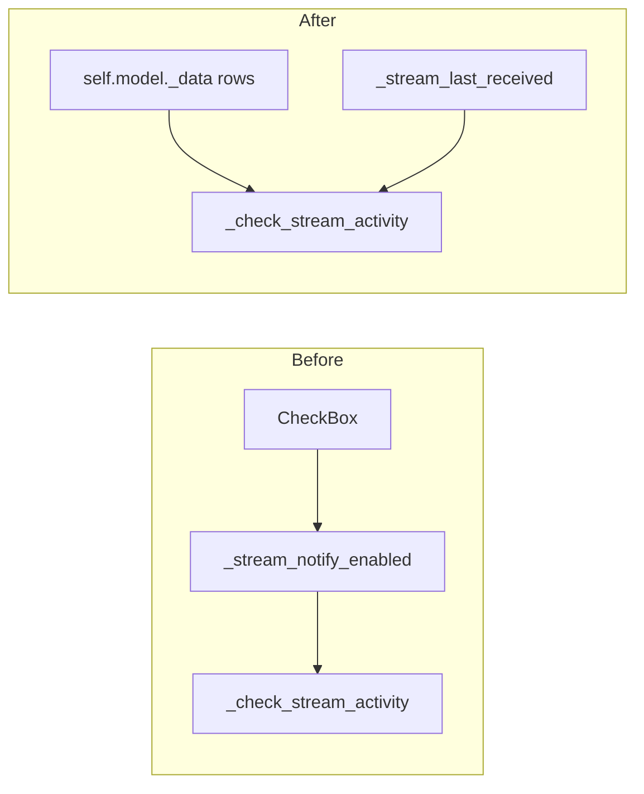

# Remove stream notify checkboxes, alerts always on

## Context

- The white squares are [`CheckBox`](c:\Users\pho\repos\EmotivEpoc\ACTIVE_DEV\stream_viewer\stream_viewer\qml\streamInfoListView.qml) controls bound to `notifyEnabled`, calling `OuterWidget.setNotifyEnabled`.
- [`StreamStatusQMLWidget._check_stream_activity`](c:\Users\pho\repos\EmotivEpoc\ACTIVE_DEV\stream_viewer\stream_viewer\widgets\stream_info.py) only considers streams present in `_stream_notify_enabled` with value `True`. Defaults are `False` ([`data()`](c:\Users\pho\repos\EmotivEpoc\ACTIVE_DEV\stream_viewer\stream_viewer\data\stream_info.py)), so removing the UI without changing this logic would **disable all stall alerts**.

## Implementation

### 1. QML — drop the checkbox

In [`stream_viewer/qml/streamInfoListView.qml`](c:\Users\pho\repos\EmotivEpoc\ACTIVE_DEV\stream_viewer\stream_viewer\qml\streamInfoListView.qml), remove the entire `CheckBox { ... }` block (keep the green `activityLed` `Rectangle` in the `Row`).

### 2. Widget — monitor all rows, remove slot

In [`stream_viewer/widgets/stream_info.py`](c:\Users\pho\repos\EmotivEpoc\ACTIVE_DEV\stream_viewer\stream_viewer\widgets\stream_info.py):

- Delete the `@QtCore.Slot(int, bool) setNotifyEnabled` method (nothing will call it after QML change).
- Rewrite `_check_stream_activity`’s alert loop: for each row in `self.model._data`, build `stream_key = (name, type, hostname, uid)` (same tuple as elsewhere). For each key that exists in `_stream_last_received`, apply the existing **\>10 s idle** logic with `_alerted_streams` deduplication. Skip rows with no `stream_last_received` entry (never received data — same as today for unchecked streams that never got a rate update).
- Remove any `getattr(..., '_stream_notify_enabled', {})` usage.

### 3. Model — remove notify role and storage

In [`stream_viewer/data/stream_info.py`](c:\Users\pho\repos\EmotivEpoc\ACTIVE_DEV\stream_viewer\stream_viewer\data\stream_info.py):

- Remove `_stream_notify_enabled` from `__init__`.
- Remove `NotifyEnabledRole` and its `roleNames` / `data()` branches.
- Remove `setNotifyEnabled` and any `dataChanged` emissions for notify.
- **Renumber** remaining roles so integers stay contiguous: `StreamLastReceivedRole = QtCore.Qt.UserRole + 11`, `ActivityFlashNonceRole = QtCore.Qt.UserRole + 12` (QML only uses role **names**; no other Python references these constants).

Optional: delete the obsolete comment *“Keep notify preferences in case stream reconnects”* in `refresh()`’s drop branch (lines 107–108); it no longer applies.

## Verification

- Run the LSL status window: list rows show only the green activity LED (no white boxes).
- With a stream that has received data at least once, simulate \>10 s without `handleRateUpdated`: expect one **Stream Data Alert** dialog per stream until data resumes (then `_alerted_streams` clears as today).

