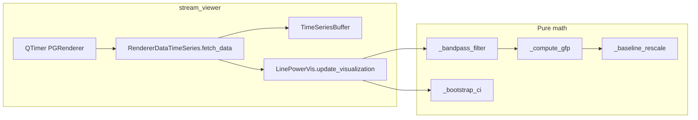

# LinePowerVis computation map, migration deps, and shared-renderer strategy

## 1. Where computation happens in [`line_power_vis.py`](c:/Users/pho/repos/EmotivEpoc/ACTIVE_DEV/stream_viewer/stream_viewer/renderers/line_power_vis.py)

All **numeric signal processing** runs inside the renderer class methods below; the **only** orchestration entry point is `update_visualization`, called each display tick from the PG timer path (`RendererBaseDisplay.on_timer` → `fetch_data` → `update_visualization` in [`display/base.py`](c:/Users/pho/repos/EmotivEpoc/ACTIVE_DEV/stream_viewer/stream_viewer/renderers/display/base.py)).

| Location | Role |
|----------|------|
| `_get_filter_sos` / `_bandpass_filter` | SciPy Butterworth SOS design + `sosfiltfilt` per channel; NaN handling via interpolation. **Depends on:** `scipy.signal`, `numpy`. |
| `_compute_gfp` | Global field power: `sum(data**2, axis=0)` on filtered `(n_ch, n_samp)`. |
| `_baseline_rescale` | Baseline division/mean correction over a time window on the 1D GFP trace. |
| `_bootstrap_ci` | Channel-resampling bootstrap over time; percentiles 2.5/97.5. **Expensive** when `show_confidence` is on (`n_bootstrap` loops per band per frame). |
| `update_visualization` | Stacks multi-source channel data (`np.vstack`), builds `t_vec = arange(n)/srate`, loops `FREQUENCY_BANDS`, applies filter → GFP → baseline → optional CI; maps time for **Sweep** (`t % duration`) vs **Scroll**; updates `PlotCurveItem` / fill items; optional y-range updates when `auto_scale != 'none'`. **Depends on:** stream_viewer buffer layout (`data[src_ix][0]` = `(data, markers)` tuple from [`RendererDataTimeSeries.fetch_data`](c:/Users/pho/repos/EmotivEpoc/ACTIVE_DEV/stream_viewer/stream_viewer/renderers/data/base.py)), `srate` from `IDataSource.data_stats`. |
| `reset_renderer` | **No** heavy math; builds `pg.GraphicsLayoutWidget`, stacked `PlotItem`s, curves, optional CI graphics, x-linking. **Depends on:** `pyqtgraph`, `qtpy.QtGui`, `chan_states`, `_buffers`, `_data_sources`, `duration`, `lower_limit`/`upper_limit` from data/display bases. |

**Constants:** `FREQUENCY_BANDS`, `BAND_COLORS` — pure data, trivial to share.

## 2. Dependencies to migrate or reuse in pyPhoTimeline

**Already aligned with pyPhoTimeline** ([`pyproject.toml`](c:/Users/pho/repos/EmotivEpoc/ACTIVE_DEV/pyPhoTimeline/pyproject.toml)): `numpy`, `scipy`, `pyqtgraph`, `qtpy`, `pandas` (timeline stack uses pandas heavily).

**Tightly coupled to stream_viewer today (must not import into pyPhoTimeline as-is):**

- [`RendererDataTimeSeries`](c:/Users/pho/repos/EmotivEpoc/ACTIVE_DEV/stream_viewer/stream_viewer/renderers/data/base.py) + [`PGRenderer`](c:/Users/pho/repos/EmotivEpoc/ACTIVE_DEV/stream_viewer/stream_viewer/renderers/display/pyqtgraph.py): `IDataSource`, `TimeSeriesBuffer`, `chan_states`, timer, `plot_mode`, `duration`, limits.
- **Unused import:** `json` in `line_power_vis.py` — dead weight for migration.

**pyPhoTimeline integration surface** (no stream_viewer types):

- [`DetailRenderer` protocol](c:/Users/pho/repos/EmotivEpoc/ACTIVE_DEV/pyPhoTimeline/pypho_timeline/rendering/datasources/track_datasource.py): `render_detail(plot_item, interval, detail_data)`, `clear_detail`, `get_detail_bounds`.
- Existing EEG precedent: [`EEGPlotDetailRenderer`](c:/Users/pho/repos/EmotivEpoc/ACTIVE_DEV/pyPhoTimeline/pypho_timeline/rendering/datasources/specific/eeg.py) — expects `detail_data` as DataFrame with `t` + channel columns.
- **Live / retrospective data:** [`LiveEEGTrackDatasource`](c:/Users/pho/repos/EmotivEpoc/ACTIVE_DEV/pyPhoTimeline/pypho_timeline/rendering/datasources/specific/lsl.py) + [`live_lsl_timeline.py`](c:/Users/pho/repos/EmotivEpoc/ACTIVE_DEV/pyPhoTimeline/live_lsl_timeline.py) already provide ring-buffered EEG and viewport follow — a GFP band stack can hook the same `fetch_detailed_data` / signals pattern.

**Qt binding note:** stream_viewer pins **PyQt5**; pyPhoTimeline pins **PyQt6**. Both use `qtpy`; sharing is fine if the process sets `QT_API` consistently. Avoid mixing raw `PyQt5`/`PyQt6` imports in shared code.

## 3. Minimal change sets for “easy sharing”

### Tier A — **Smallest, highest value (recommended first)**

1. **Extract a pure-Python module** (new small package or a neutral home such as [`PhoPyMNEHelper`](c:/Users/pho/repos/EmotivEpoc/ACTIVE_DEV/PhoPyMNEHelper) if you want EEG-adjacent reuse) with functions like:
   - `bandpass_sosfilt(data_chans_samples, srate, fmin, fmax, order, filter_cache_keyed_dict)`  
   - `gfp_from_filtered(filtered)`  
   - `baseline_correct(gfp, t, start, end)`  
   - `bootstrap_gfp_ci(filtered, n_boot, rng)`  
   Optionally export band definitions as data.

2. **Refactor `LinePowerVis`** to call that module (behavior unchanged) — keeps stream_viewer as the consumer of buffers + PG layout.

3. **Add a pyPhoTimeline `DetailRenderer`** (e.g. `LinePowerGFPDetailRenderer`) that:
   - Accepts the same input shape as EEG detail DataFrames (`t` + channels) or a thin wrapper that builds `(n_ch, n_samp)` from columns.
   - Runs the shared functions once per `render_detail` (retrospective interval) or on a throttled timer for live (see Tier B).
   - Builds stacked `pg.PlotItem`s either as child items / `GraphicsLayout` in the detail region, or multiple `PlotCurveItem`s on one item with vertical offsets — match existing timeline UX patterns.

**Effort:** low–medium; **no** new dependency between pyPhoTimeline and stream_viewer.

### Tier B — **Real-time GFP on the timeline**

- Reuse **live EEG** path: on `new_data_available` or a dedicated `QTimer`, pull the latest window from [`LiveEEGTrackDatasource.fetch_detailed_data`](c:/Users/pho/repos/EmotivEpoc/ACTIVE_DEV/pyPhoTimeline/pypho_timeline/rendering/datasources/specific/lsl.py) (or add a `get_recent_array()` API to avoid DataFrame overhead), run Tier-A functions, update graphics.
- **Performance:** disable or heavily throttle bootstrap CI in live mode (`n_bootstrap` small or off); consider computing only the visible viewport duration.

### Tier C — **Optional shared “PG track widget”**

- Extract a `LinePowerGFPGraphicsBuilder` that owns `GraphicsLayoutWidget` + curves given arrays — callable from both `LinePowerVis.update_visualization` and a timeline-hosted widget. More coupling to pyqtgraph; only worth it if many PG renderers duplicate layout code.

## 4. Other stream_viewer renderers — migration rough cost

| Renderer | Main compute deps | Shareability |
|----------|-------------------|--------------|
| [`line_pg.py`](c:/Users/pho/repos/EmotivEpoc/ACTIVE_DEV/stream_viewer/stream_viewer/renderers/line_pg.py) | Mostly display; data from buffers | Easiest — closest to `EEGPlotDetailRenderer` |
| [`line_power_vis.py`](c:/Users/pho/repos/EmotivEpoc/ACTIVE_DEV/stream_viewer/stream_viewer/renderers/line_power_vis.py) | scipy + numpy (above) | Tier A extract then DetailRenderer |
| [`heatmap_pg.py`](c:/Users/pho/repos/EmotivEpoc/ACTIVE_DEV/stream_viewer/stream_viewer/renderers/heatmap_pg.py) | scipy STFT/spectrogram, stateful scroll/sweep | Medium — large state; extract STFT + dB scaling first |
| [`topo_mne.py`](c:/Users/pho/repos/EmotivEpoc/ACTIVE_DEV/stream_viewer/stream_viewer/renderers/topo_mne.py) | MNE, montage | pyPhoTimeline already depends on `phopymnehelper` / MNE ecosystem — natural fit for detail or separate dock |
| [`bar_pg.py`](c:/Users/pho/repos/EmotivEpoc/ACTIVE_DEV/stream_viewer/stream_viewer/renderers/bar_pg.py) | Aggregation in `update_visualization` | Low–medium |

## 5. Suggested documentation deliverable (after you approve implementation)

Add a **short module-level “Computation & integration” section** at the top of [`line_power_vis.py`](c:/Users/pho/repos/EmotivEpoc/ACTIVE_DEV/stream_viewer/stream_viewer/renderers/line_power_vis.py) (or a comment block above `LinePowerVis`) that points to: entry point `update_visualization`, pure methods `_bandpass_filter` / `_compute_gfp` / `_baseline_rescale` / `_bootstrap_ci`, stream_viewer-only coupling (`fetch_data`, buffers, `srate`), and the intended shared module name for extract. This satisfies “document where computation is done” without a new markdown file unless you want one.
