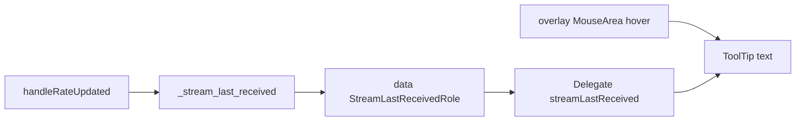

# Tooltip for stream status indicator (last received time)

## Context

- **Model**: [`stream_viewer/data/stream_info.py`](c:\Users\pho\repos\EmotivEpoc\ACTIVE_DEV\stream_viewer\stream_viewer\data\stream_info.py) maintains `_stream_last_received` as `{(name, type, hostname, uid): unix_time}` and already updates it in `handleRateUpdated()`.
- **QML**: [`stream_viewer/qml/streamInfoListView.qml`](c:\Users\pho\repos\EmotivEpoc\ACTIVE_DEV\stream_viewer\stream_viewer\qml\streamInfoListView.qml) draws the green circle as `activityLight` inside a `Row` in the delegate. A **`MouseArea` with `anchors.fill: parent` is declared after the `GridLayout`**, so it sits on top and captures pointer events for the whole row—including the indicator. A tooltip attached only to `activityLight` would not see hover without changing stacking or adding an overlay.
- **[`stream_viewer/widgets/stream_info.py`](c:\Users\pho\repos\EmotivEpoc\ACTIVE_DEV\stream_viewer\stv_stream_viewer\widgets\stream_info.py)** and **[`stream_viewer/applications/stream_status_qml.py`](c:\Users\pho\repos\EmotivEpoc\ACTIVE_DEV\stream_viewer\stream_viewer\applications\stream_status_qml.py)**: No changes required for this feature; the model is already registered as `MyModel`.

## 1. New model role (Python)

In **`LSLInfoItemModel`** in [`stream_viewer/data/stream_info.py`](c:\Users\pho\repos\EmotivEpoc\ACTIVE_DEV\stream_viewer\stream_viewer\data\stream_info.py):

- Add a new role constant, e.g. `StreamLastReceivedRole = QtCore.Qt.UserRole + 12` (after `NotifyEnabledRole`).
- Register it in `roleNames()` with a QML-friendly name, e.g. `b'streamLastReceived'`.
- In `data()`, when `role == StreamLastReceivedRole`:
  - Build `stream_key` the same way as for `ActivityStateRole`.
  - If missing from `_stream_last_received`, return a clear string such as `"No data received yet"` (matches `activityState === 'none'`).
  - Otherwise format `self._stream_last_received[stream_key]` as a **local wall-clock time** (e.g. `time.strftime('%Y-%m-%d %H:%M:%S', time.localtime(ts))` or with fractional seconds if desired—keep one consistent format).

**Refresh behavior**: `handleRateUpdated()` already calls `self.dataChanged.emit(cell_index, cell_index)` with no role vector; in Qt this typically invalidates **all** roles for that index, so the tooltip text will update when new samples arrive. The monitor timer in `StreamStatusQMLWidget._check_stream_activity` only emits `ActivityStateRole`; that is still fine for an **absolute** “last received at …” string, since the timestamp only changes when `_stream_last_received` updates (on `handleRateUpdated`).

## 2. Hover tooltip (QML)

In [`stream_viewer/qml/streamInfoListView.qml`](c:\Users\pho\repos\EmotivEpoc\ACTIVE_DEV\stream_viewer\stream_viewer\qml\streamInfoListView.qml), inside the delegate `Rectangle`:

- Give the root delegate a stable `id` (e.g. `delegateRoot`).
- Give the `Row` that contains `activityLight` an `id` (e.g. `statusRow`).
- Keep the existing full-row `MouseArea` for `onClicked` / `onDoubleClicked`.
- Add a **second `MouseArea`** as a **later sibling** (so it is drawn **on top**, higher stacking order than the full-row area), with:
  - `z: 1` if needed for clarity alongside the full-row area.
  - **Geometry**: `x` / `y` from `activityLight.mapToItem(delegateRoot, 0, 0)`, `width` / `height` matching `activityLight`.
  - `hoverEnabled: true`
  - `acceptedButtons: Qt.NoButton` so clicks **fall through** to the row `MouseArea` / `CheckBox` behavior.
  - Attached **`ToolTip`** from Qt Quick Controls: `text` bound to `streamLastReceived` (the new role), optional `delay` (e.g. 300–500 ms).

This avoids fragile hard-coded offsets and fixes the “full-row MouseArea on top” issue.

## 3. Verification

- Run the LSL status window, confirm hover over the **green/orange/red circle** shows the formatted time (or “no data” when never received).
- Confirm single/double-click on the row and **CheckBox** still behave as before (overlay must not swallow clicks).

