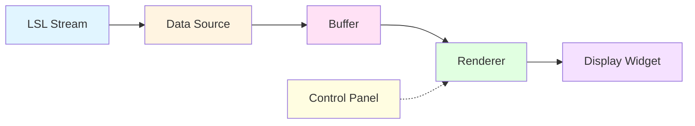
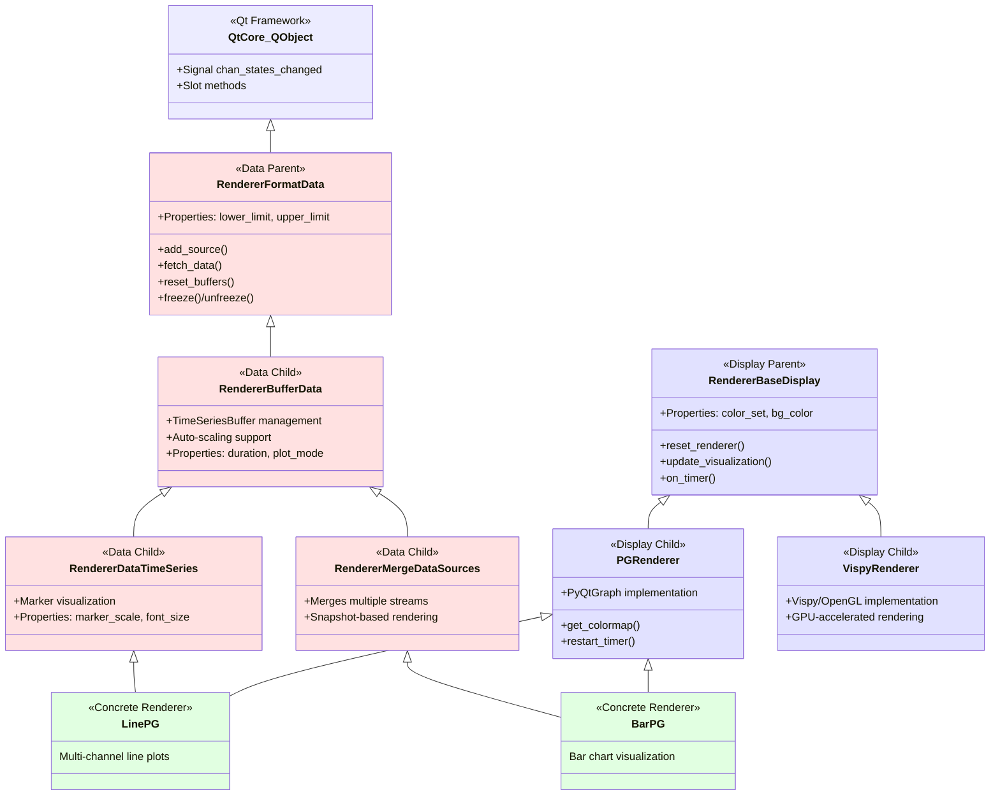
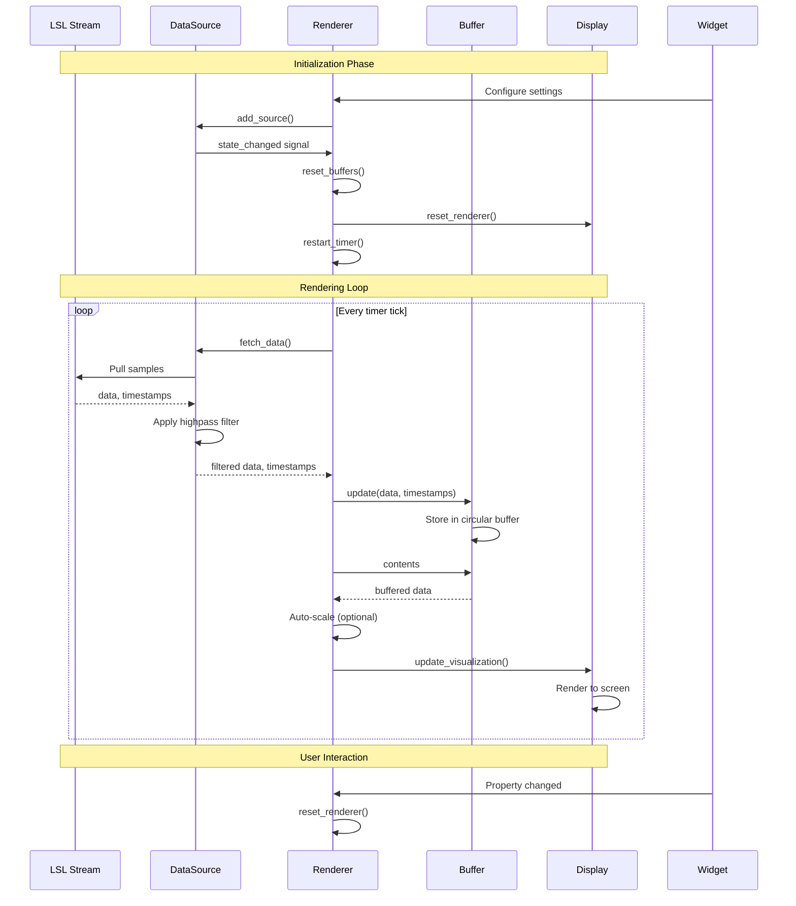
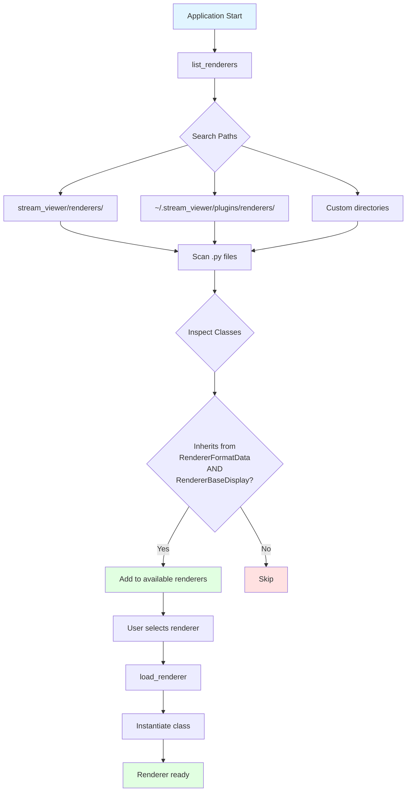
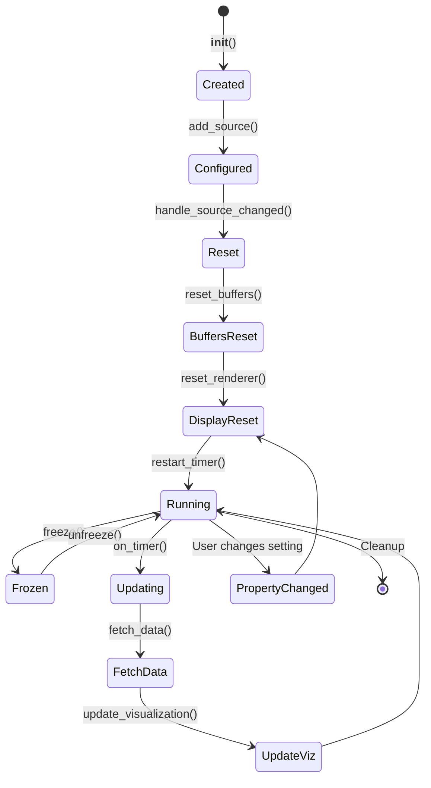

# Renderer Architecture

## Introduction

StreamViewer is built on a modular, extensible architecture that separates concerns between data acquisition, buffering, visualization, and user interface. This design philosophy enables developers to add custom visualizations without modifying the core application code.

The renderer system is the heart of StreamViewer's visualization capabilities. It uses a **cooperative inheritance pattern** that combines data handling and display logic through multiple inheritance, allowing renderers to mix and match capabilities from different base classes.

## System Overview

StreamViewer follows a pipeline architecture where data flows from external sources through several processing stages before being displayed:



### Core Components

1. **Data Sources** (`stream_viewer.data`): Abstract streaming data inputs (primarily LSL streams)
2. **Buffers** (`stream_viewer.buffers`): Manage data storage and retrieval for visualization
3. **Renderers** (`stream_viewer.renderers`): Transform buffered data into visual representations
4. **Widgets** (`stream_viewer.widgets`): Provide UI controls for renderer configuration
5. **Applications** (`stream_viewer.applications`): Pre-built GUI applications that wire everything together

## Renderer Class Hierarchy

Renderers use **cooperative multiple inheritance** to combine data handling and display capabilities. This pattern allows flexible composition of features without code duplication.



### Cooperative Inheritance Pattern

Concrete renderers inherit from **both** a data parent class and a display parent class:

```python
class LinePG(RendererDataTimeSeries, PGRenderer):
    """
    Combines time series data handling with PyQtGraph display.
    """
    pass
```

This pattern requires calling `super().__init__(**kwargs)` in each class to ensure all parent constructors are invoked in the correct order (Method Resolution Order - MRO).

**Key Benefits:**
- **Separation of Concerns**: Data logic is independent of display technology
- **Reusability**: Mix and match data handlers with different display backends
- **Extensibility**: Add new data types or display technologies independently

**Example Combinations:**
- `RendererDataTimeSeries` + `PGRenderer` = Time series with PyQtGraph
- `RendererDataTimeSeries` + `VispyRenderer` = Time series with GPU acceleration
- `RendererMergeDataSources` + `PGRenderer` = Snapshot visualizations (bar charts, radar plots)

## Data Flow Architecture

The complete data flow from LSL stream to display involves several transformation stages:



### Data Processing Pipeline

1. **Acquisition**: `DataSource.fetch_data()` pulls raw samples from LSL
2. **Filtering**: Optional highpass filter applied to remove DC offset
3. **Buffering**: Data stored in appropriate buffer type (TimeSeriesBuffer, MergeLastOnlyBuffer)
4. **Scaling**: Optional auto-scaling maps data to visualization range
5. **Rendering**: Display-specific code draws the visualization
6. **Update**: Timer triggers next iteration (typically 30-60 Hz)

## Buffer Types

Buffers manage data storage between acquisition and visualization. Different buffer types serve different rendering needs:

### TimeSeriesBuffer

**Purpose**: Store complete time series for scrolling or sweeping plots

**Characteristics:**
- Fixed size based on `duration` and `srate`
- Two modes: "Scroll" (shift data left) or "Sweep" (circular buffer)
- Handles irregular sample rates by interpolation
- Stores both data and marker streams

**Use Cases:**
- Line plots showing historical data
- EEG/neural signal visualization
- Any renderer displaying time evolution

**Example:**
```python
buffer = TimeSeriesBuffer(
    mode="Sweep",
    srate=250.0,  # Hz
    duration=10.0,  # seconds
    indicate_write_index=True
)
buffer.reset(n_chans=8)
```

### MergeLastOnlyBuffer

**Purpose**: Combine multiple streams, keeping only the most recent sample

**Characteristics:**
- Minimal memory footprint (1 sample per channel)
- Merges data from multiple sources into single array
- Discards historical data

**Use Cases:**
- Bar charts showing current values
- Topographic maps (brain activity snapshots)
- Radar/polar plots
- Any "right now" visualization

**Example:**
```python
buffer = MergeLastOnlyBuffer()
buffer.reset(n_chans=32)
# Updates from multiple sources are merged
buffer.update(data1, ts1, chan_states, source_id="stream1")
buffer.update(data2, ts2, chan_states, source_id="stream2")
```

### Buffer Selection Guide

| Visualization Type | Buffer Type | Data Parent Class |
|-------------------|-------------|-------------------|
| Time series plots | TimeSeriesBuffer | RendererDataTimeSeries |
| Snapshot displays | MergeLastOnlyBuffer | RendererMergeDataSources |
| Custom buffering | Implement StreamDataBuffer | RendererBufferData |

## Plugin Discovery System

StreamViewer uses a **resolver pattern** to dynamically discover and load renderers at runtime. This enables users to add custom renderers without modifying the core application.



### Plugin Search Paths

Default search locations (in order):
1. `stream_viewer/renderers/` - Built-in renderers
2. `~/.stream_viewer/plugins/renderers/` - User plugins
3. Additional directories specified in application settings

### Discovery Requirements

For a class to be recognized as a renderer, it must:
1. Be defined in a `.py` file in a search path
2. Inherit from **both** `RendererFormatData` and `RendererBaseDisplay`
3. Have a unique class name

**Example Plugin Structure:**
```
~/.stream_viewer/plugins/renderers/
└── my_custom_renderer.py
    └── class MyCustomRenderer(RendererDataTimeSeries, PGRenderer):
            ...
```

### Loading Renderers

```python
from stream_viewer.renderers.resolver import list_renderers, load_renderer

# Discover available renderers
available = list_renderers(extra_search_dirs=['/path/to/custom/plugins'])
# Returns: ['LinePG', 'BarPG', 'HeatmapPG', 'MyCustomRenderer', ...]

# Load a specific renderer class
RendererClass = load_renderer('MyCustomRenderer')

# Instantiate with configuration
renderer = RendererClass(
    duration=10.0,
    color_set='viridis',
    lower_limit=-100,
    upper_limit=100
)
```

## Renderer Lifecycle

Understanding the renderer lifecycle is crucial for implementing custom renderers correctly:



### Lifecycle Methods

1. **`__init__(**kwargs)`**: Initialize renderer with configuration parameters
   - Set initial property values
   - Call `super().__init__(**kwargs)` for cooperative inheritance
   - Create display widgets (e.g., `pg.GraphicsLayoutWidget()`)

2. **`add_source(data_source)`**: Register a data source
   - Connect to source's `state_changed` signal
   - Trigger `handle_source_changed()` immediately

3. **`reset_buffers()`**: Configure data buffers
   - Create appropriate buffer type(s)
   - Size buffers based on sample rate and duration
   - Called automatically when sources change

4. **`reset_renderer(reset_channel_labels=True)`**: Rebuild visualization
   - Clear existing plot elements
   - Create new plot items for each channel
   - Apply current color scheme and styling
   - Called after buffer reset and when properties change

5. **`on_timer()`**: Periodic update callback
   - Fetch new data from sources via buffers
   - Call `update_visualization()` with new data

6. **`update_visualization(data, timestamps)`**: Render new data
   - Update plot items with new values
   - Handle markers, labels, and annotations
   - Optimize for real-time performance

7. **`freeze()` / `unfreeze()`**: Pause/resume rendering
   - Stop/start timer
   - Put data sources in monitor mode (auto-flush)

## Settings Persistence

Renderers support saving and restoring configuration through Qt's QSettings system.

### gui_kwargs Dictionary

Each renderer class defines a `gui_kwargs` dictionary that specifies which properties should be persisted:

```python
class LinePG(RendererDataTimeSeries, PGRenderer):
    gui_kwargs = dict(
        RendererDataTimeSeries.gui_kwargs,  # Inherit parent settings
        **PGRenderer.gui_kwargs,
        offset_channels=bool,
        line_width=float,
        antialias=bool,
        ylabel_width=int
    )
```

The dictionary maps property names to their types, enabling automatic type conversion when loading from INI files.

### Saving Settings

```python
renderer.save_settings('my_app.ini')
# Creates ~/.stream_viewer/my_app.ini with:
# [RendererKey]
# renderer=LinePG
# duration=10.0
# color_set=viridis
# offset_channels=true
# line_width=2.0
```

### Loading Settings

```python
from stream_viewer.renderers.resolver import get_kwargs_from_settings

settings = QtCore.QSettings('my_app.ini', QtCore.QSettings.IniFormat)
settings.beginGroup('RendererKey')
renderer_kwargs = get_kwargs_from_settings(settings, LinePG)
renderer = LinePG(**renderer_kwargs)
```

## Property Decorators and Qt Slots

Renderers expose properties that can be controlled by widgets through Qt's signal/slot mechanism.

### Property Pattern

```python
@property
def duration(self):
    return self._duration

@duration.setter
def duration(self, value):
    self._duration = value
    self.reset(reset_channel_labels=False)  # Trigger update

@QtCore.Slot(float)
def duration_valueChanged(self, value):
    """Slot for connecting to widget signals"""
    self.duration = value
```

### Widget Connection

Control panel widgets connect to these slots:

```python
# In widget code
duration_spinbox.valueChanged.connect(renderer.duration_valueChanged)

# User changes spinbox -> signal emitted -> slot called -> property updated -> renderer resets
```

This pattern enables:
- **Decoupling**: Widgets don't need renderer-specific knowledge
- **Consistency**: Property changes always trigger appropriate updates
- **Persistence**: Properties in `gui_kwargs` are automatically saved

## Performance Considerations

Real-time rendering requires careful attention to performance:

### Optimization Strategies

1. **Minimize reset_renderer() calls**: Only reset when necessary (channel changes, major reconfigurations)
2. **Efficient update_visualization()**: Update existing plot items rather than recreating
3. **Use appropriate buffer sizes**: Balance memory usage with visualization needs
4. **Leverage GPU acceleration**: Use Vispy for high-channel-count visualizations
5. **Limit auto-scaling**: Auto-scaling adds computational overhead
6. **Reduce marker rendering**: Text rendering is expensive; pool and reuse text items

### Typical Performance Targets

- **Update rate**: 30-60 Hz for smooth visualization
- **Channels**: 32-64 channels with PyQtGraph, 100+ with Vispy
- **Sample rate**: Up to 1000 Hz per channel
- **Latency**: < 100ms from data acquisition to display

### PyQtGraph vs. Vispy

| Feature | PyQtGraph | Vispy |
|---------|-----------|-------|
| Rendering | CPU-based | GPU-accelerated |
| Channel capacity | 32-64 | 100+ |
| Ease of use | High | Moderate |
| Flexibility | High | Moderate |
| Performance | Good | Excellent |
| Use case | General purpose | High-performance |

## Summary

The StreamViewer renderer architecture provides:

- **Modularity**: Clear separation between data handling and display
- **Extensibility**: Plugin system for custom renderers
- **Flexibility**: Cooperative inheritance enables feature composition
- **Performance**: Optimized for real-time streaming visualization
- **Usability**: Settings persistence and widget integration

Understanding this architecture enables developers to create custom renderers that integrate seamlessly with the StreamViewer ecosystem.
